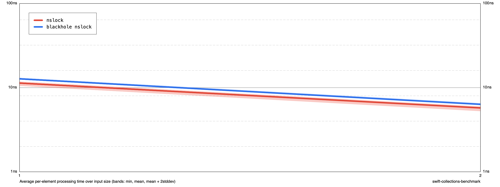

# BenchLearning

There's an executable deliverable that creates a simple benchmark, just to poke at the difference in speed between
using os_unfair_lock and NSLock. It's purely a mechanism to learn/explore how to use
[swift-collections-benchmark](https://github.com/apple/swift-collections-benchmark).

It's easiest to run from the command line:

```bash
rm results
swift run -c release sample-benchmark run --cycles 50 --max-size 2 results
swift run -c release sample-benchmark render results chart.png
open chart.png
```


